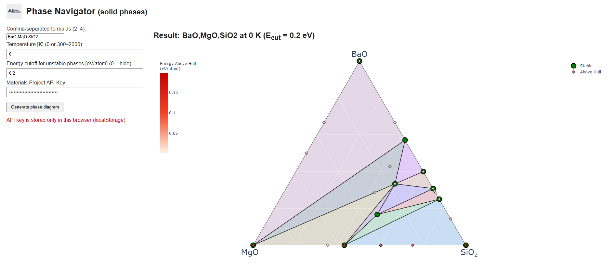

<p align="center">
  
</p>

# Phase Navigator

*Interactive phase-diagram generator for up to 4 components (solid phases) using the Materials Project API and **pymatgen**.*

## Key Features
- ⚡ **Fast**: direct query to Materials Project and on-the-fly Plotly rendering  
- 🔒 **Per-user API keys**: the key never leaves your browser (localStorage)  
- 📊 **Custom energy cutoff & temperature** (0 K or 300–2000 K)  
- 🖼 **Responsive UI**: form on the left, diagram on the right, mobile-friendly  

## Quick start

```bash
# 1 — build
docker build -t phasenavigator .

# 2 — run (detached)
docker run -p 8000:8000 phasenavigator
```

## Screenshot
 